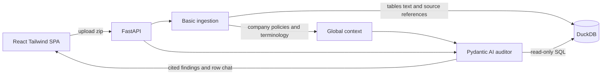

# Fraud Audit Agent — MVP + Phased Roadmap

## Goal

The bare-minimum end-to-end slice from [pre-docs/prd.md](pre-docs/prd.md) and [pre-docs/architecture.md](pre-docs/architecture.md): upload a dossier ZIP, make its structured rows and document text available in DuckDB, create a small reusable global context, run **one** Pydantic AI auditor agent, and show cited findings in a simple React UI with chat scoped to a selected finding.

## Architecture (MVP slice)

DuckDB is used because it is an embedded analytical database that requires no separate service and is sufficient for the single-user hackathon MVP. Use one database per uploaded batch; production concurrency is out of scope.

## Repo layout

- `backend/` — Python (FastAPI, Pydantic AI, DuckDB, pandas/openpyxl, and simple document text extractors), managed with `uv`
  - `backend/app/ingestion/` — ZIP extraction and basic loaders for GDPdU TXT/XML, CSV, XLSX, DOCX, and PDF
  - `backend/app/agent/` — one auditor agent, read-only `run_sql` tool, and finding-scoped chat
  - `backend/app/models.py` — minimal contracts for findings, citations, global context, chat, and progress
  - `backend/app/main.py` — upload/analyze endpoint and AG-UI endpoint for finding chat
- `frontend/` — Vite, React, TypeScript, Tailwind, and CopilotKit
  - Single page: upload → progress → findings table → chat with the selected finding
- `docs/mvp.md` — short implementation notes and deliberate limitations
- `docs/roadmap.md` — later phases toward the full PRD

## MVP scope decisions (deliberately minimal)

- **Basic ingestion across all supplied formats:** load TXT/CSV/XLSX rows and extract plain text from DOCX/PDF. Do not build perfect semantic models or OCR in the MVP.
- **Stable provenance:** assign each source a `document_id`; preserve source row, sheet, page, or passage references so findings can cite the original evidence.
- **Small global context:** extract only reusable company facts, policies, important terminology, and document relationships with citations. Do not put suspected fraud conclusions into this context.
- **One general agent:** let the agent inspect global context and query DuckDB. Do not prime it with F1–F4, known entities, planted answers, or content from `data/info.md`.
- **Minimal finding contract:** `Finding {id, title, description, likelihood, citations[]}` and `Citation {document_id, file, row | sheet | page | passage, excerpt}`. Findings without citations are invalid.
- **Finding-scoped chat:** clicking `Chat with AI` passes the selected finding ID, its citations, and relevant context to the same agent.
- **Minimal verification:** run one manual smoke test on the sample dossier. Extensive unit, integration, evaluation, and security testing are postponed.
- **Out of scope:** multi-agent orchestration, verifier agent, deterministic test library, accept/reject workflow, evidence highlighting, advanced scoring, OCR, authentication, and production concurrency.

## `docs/mvp.md` contents

Keep it short: architecture diagram, basic data model, API/chat contracts, supported formats, provenance rules, global-context shape, how to run the app, and known limitations.

## Phased roadmap (`docs/roadmap.md`)

- **Phase 1 — Ingestion hardening:** better normalization, malformed-file handling, OCR if required, and richer document structure.
- **Phase 2 — Deterministic audit tests:** reusable procedures for three-way matching, new-vendor risk, approval separation, capitalization, cut-off, threshold splitting, round amounts, and related parties.
- **Phase 3 — Verification and scoring:** verifier agent if useful, counter-evidence checks, multi-source corroboration, and calibrated confidence.
- **Phase 4 — Auditor UX:** highlighted evidence viewer, accept/reject/annotate, and financial-impact rollups.
- **Phase 5 — Evaluation and production:** isolated answer-key evaluation, unseen-dossier readiness, authentication, concurrency, observability, retention, and deployment.

## Notes

- OpenAI is the model provider; load `OPENAI_API_KEY` from the environment.
- After implementation, append the change entry to `logs/agent-changes.log` per `AGENTS.md`.

