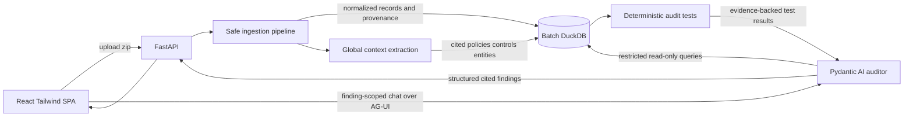

# Fraud Audit Agent — MVP + Phased Roadmap

## Goal

Build the smallest credible version of the product described in [pre-docs/prd.md](pre-docs/prd.md) and [pre-docs/architecture.md](pre-docs/architecture.md): upload a dossier, make all supplied files queryable and citable, establish how the company is expected to operate, run a few repeatable audit procedures, show evidence-backed findings with stable IDs, and let the auditor chat about a selected finding.

The MVP must validate the product's main risk: connecting structured accounting rows with policies and supporting evidence from mixed-format documents. It must not be hard-coded to a planted fraud case in the sample dossier.

## Architecture (MVP slice)



## Why DuckDB for the MVP

DuckDB is an implementation convenience, not a scaling requirement. The sample dataset is small enough for SQLite or Postgres, but DuckDB fits local analytical scans and joins, requires no database service, integrates cleanly with Python, and can store one self-contained database per uploaded batch.

Use `data/runs/{batch_id}/audit.duckdb` so uploads cannot mix. Keep database access behind repositories, avoid DuckDB-specific SQL where practical, and give the agent only a restricted read-only query tool. Production concurrency and a possible Postgres migration remain outside the MVP.

## Repo layout

- `backend/` — Python managed with `uv`; FastAPI, Pydantic AI, DuckDB, and focused format parsers.
  - `backend/app/ingestion/` — safe ZIP extraction, file inventory, GDPdU schema reader, and adapters for TXT/CSV/XLSX/DOCX/PDF.
  - `backend/app/preanalysis/` — extraction of reusable, cited global dossier context.
  - `backend/app/audit_tests/` — deterministic SQL/Python procedures returning structured evidence, not final narratives.
  - `backend/app/agent/` — one auditor agent, finding generation, restricted SQL access, and finding-scoped chat.
  - `backend/app/models.py` — shared Pydantic contracts.
  - `backend/app/main.py` — batch upload/analysis, progress streaming, findings, citations, and chat endpoints.
- `frontend/` — Vite, React, TypeScript, Tailwind, and CopilotKit/AG-UI for finding-scoped chat.
  - One page: upload, progress, findings table, visible finding IDs, citation details, and a chat panel for the selected finding.
- `docs/mvp.md` — implemented architecture, contracts, supported formats, provenance rules, test procedures, and known limitations.
- `docs/roadmap.md` — improvements that extend the MVP without redefining its core data model.

## MVP scope decisions

### 1. Broad but shallow ingestion

Ingest every format present in the supplied dossier. The goal is reliable access and provenance, not perfect semantic modeling of every document.

- **GDPdU XML/TXT:** parse `index.xml`, respect declared fields, handle Windows-1252/Latin-1, semicolon delimiters, German decimals, and `DD.MM.YYYY` dates.
- **CSV:** detect encoding and delimiter, preserve the original header/value alongside normalized values where normalization could be lossy.
- **XLSX:** ingest every relevant sheet with sheet name and source row.
- **DOCX:** extract paragraphs and tables with stable paragraph/table-cell identifiers.
- **PDF:** extract text per page and split it into stable passages. OCR is out of scope unless a supplied PDF has no text layer.

ZIP extraction must reject path traversal, cap file count and uncompressed size, and ignore unsupported executable content.

Every source receives a stable `document_id`. Every ingested item carries, as applicable:

- `batch_id`
- `document_id`
- `source_file`
- `source_table` or `source_sheet`
- `source_row`
- `source_page`
- `passage_id`
- `original_value` where required for verification

### 2. Global dossier context before analysis

Build a compact context used by every audit test, finding-generation request, and finding chat. It contains reusable facts only:

- Company identity, industry, fiscal period, and currency
- Audit scope and materiality when stated
- Approval thresholds and accounting policies
- Important accounts and document/status-code meanings
- Employees, authorized approvers, vendors, and related parties when available
- Expected controls and documented exceptions
- German/English accounting terminology
- Candidate join keys and document relationships

Every extracted fact must include a source location and supporting excerpt. Do not include suspicions or conclusions such as “vendor X is fraudulent”; those belong to analysis.

### 3. Small deterministic audit-test library

Implement three general procedures in the MVP:

1. **New-vendor risk:** identify payments or invoices involving recently created or changed vendors and report available corroborating or missing evidence.
2. **Approval separation:** compare creator and approver identities using the documented control rules and authorization data.
3. **Threshold splitting:** use the cited approval threshold from global context to find same-vendor, same-day clusters near or below the limit.

Each procedure returns typed `TestResult` objects containing inputs, rule parameters, evidence citations, counter-evidence checked, and a status. Procedures must not directly label a party as fraudulent.

Additional procedures such as three-way matching, capitalization-versus-repair wording, cut-off, related-party checks, and statistical tests belong in the roadmap.

### 4. One agent, general guidance

Use one Pydantic AI auditor agent to interpret deterministic test results, gather limited additional evidence, consider innocent explanations, and produce `list[Finding]` as structured output.

The system prompt describes general audit behavior and the available procedures. It must not mention F1–F4, planted entities, known answers, or recipes copied from `data/info.md`. The sample answer key must not be available to the runtime pipeline.

The optional SQL tool must:

- Connect only to the current batch database
- Be read-only and accept only a single `SELECT`/CTE query
- Reject DDL, DML, filesystem functions, extensions, and external reads
- Enforce row and execution-time limits
- Return provenance columns with evidence rows

### 5. Minimal auditor UI and row-scoped chat

The single-page UI includes:

- ZIP upload
- Progress states: pre-analyzing, ingesting, testing, analyzing, complete/error
- Findings table with a unique visible finding ID, description, likelihood, and citations
- A `Chat with AI` action for every finding
- A chat panel automatically scoped to the selected `finding_id`, its test results, citations, relevant source records, and global context

The chat may answer follow-up questions and run restricted read-only queries. Accept/reject workflows, advanced scoring, and a rendered evidence viewer are postponed.

## Core contracts

Define contracts before implementation so ingestion, tests, agent, and UI share stable identifiers.

```text
SourceLocation {
  batch_id,
  document_id,
  source_file,
  location_type,
  source_table?,
  source_sheet?,
  source_row?,
  source_page?,
  passage_id?,
  excerpt?
}

GlobalFact {
  id,
  category,
  name,
  value,
  parameters,
  source: SourceLocation
}

TestResult {
  id,
  test_type,
  status,
  summary,
  parameters,
  evidence: SourceLocation[],
  counter_evidence_checked: SourceLocation[]
}

Finding {
  id,
  title,
  description,
  likelihood,
  test_result_ids[],
  citations: Citation[]
}

Citation {
  claim,
  source: SourceLocation
}
```

Findings without citations fail validation. Aggregated findings retain citations to every contributing source row rather than citing only an aggregate query result.

## API surface

- `POST /batches` — upload dossier and return `batch_id`
- `GET /batches/{batch_id}/events` — stream pipeline progress
- `GET /batches/{batch_id}/findings` — list structured findings
- `GET /batches/{batch_id}/sources/{document_id}` — retrieve source metadata or text needed to verify a citation
- `POST /batches/{batch_id}/findings/{finding_id}/chat` — finding-scoped chat via AG-UI

If AG-UI integration becomes a schedule risk, keep the same chat contract and use a normal streaming FastAPI response; do not remove finding-scoped chat from the MVP.

## End-to-end verification

Run against the sample dossier with `data/info.md` excluded from all runtime context and verify:

- The ZIP is safely extracted into an isolated batch directory.
- All supported files appear in the document inventory.
- Representative TXT, CSV, XLSX, DOCX, and PDF content is queryable.
- German encodings, decimals, and dates normalize correctly.
- Every record or passage resolves back to an original file location.
- Global facts such as an approval threshold retain exact citations.
- Deterministic procedures return repeatable results and counter-evidence checks.
- Every finding has a stable ID and at least one valid citation.
- Selecting a finding opens chat with the correct finding and batch context.
- A known sample finding may be used as an acceptance check, but no sample-specific identity or fraud recipe appears in prompts or application code.

## Deliberately postponed

- Multi-agent orchestration and verifier agent
- Full F1–F4/K1–K7 procedure coverage
- OCR for image-only documents unless required by the supplied dossier
- Highlighted PDF/DOCX rendering
- Auditor accept/reject/annotation workflow
- Sophisticated confidence and financial-impact scoring
- Authentication, multi-user concurrency, retention policies, and production database migration

## `docs/mvp.md` contents

Document the architecture, batch lifecycle, DuckDB rationale and limitations, source/provenance model, global-context schema, supported format behavior, audit-test contracts, API/AG-UI contracts, security limits, and deliberately postponed work.

## Phased roadmap (`docs/roadmap.md`)

- **Phase 1 — Test coverage and ingestion hardening:** add three-way matching, capitalization-versus-expense wording, cut-off, related-party, round-amount and broader reconciliation tests; improve malformed-file handling and OCR where needed.
- **Phase 2 — Decoy discipline and verification:** add explicit counter-evidence requirements, a verifier agent if evaluation shows value, multi-source corroboration, and calibrated confidence.
- **Phase 3 — Auditor evidence UX:** render original documents at cited rows/pages/passages, highlight excerpts, and add accept/reject/annotation workflows.
- **Phase 4 — Evaluation and unseen-dossier readiness:** build a harness that measures precision/recall with answer keys isolated from runtime, mutation tests for changed thresholds/entities, and a judging-day dry run.
- **Phase 5 — Production hardening:** authentication, concurrent users, persistent job execution, database migration if needed, observability, retention, and deployment.

## Notes

- OpenAI is the model provider; load `OPENAI_API_KEY` from the environment and never persist it in a batch database or logs.
- Append implementation changes to `logs/agent-changes.log` as required by `AGENTS.md`.
