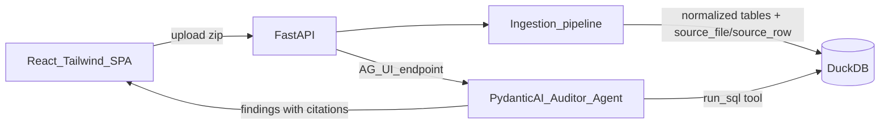

# Fraud Audit Agent — MVP + Phased Roadmap

## Goal

The bare-minimum end-to-end slice from [pre-docs/prd.md](pre-docs/prd.md) and [pre-docs/architecture.md](pre-docs/architecture.md): upload a dossier zip (like `data/Uebungsdaten_Muster_Verpackungen.zip`), normalize it into DuckDB, run **one** Pydantic AI agent with a SQL tool, and show cited findings in a simple React UI. Clean seams so phases 1–5 build on top without rewrites.

## Architecture (MVP slice)

## Repo layout

- `backend/` — Python (FastAPI + Pydantic AI + DuckDB + pandas + openpyxl), managed with `uv`
  - `backend/app/ingestion/` — zip extract, GDPdU `index.xml` schema reader, Latin-1/German-format normalization, loaders per folder
  - `backend/app/agent/` — the single auditor agent + `run_sql` tool
  - `backend/app/models.py` — Pydantic contracts: `Finding {id, title, description, likelihood, citations[]}`, `Citation {file, row_ids | passage}` (citations are structurally required — no finding without one)
  - `backend/app/main.py` — FastAPI: `POST /analyze` (upload zip → ingest → agent run, with staged progress) + AG-UI endpoint for the agent
- `frontend/` — Vite + React + TS + Tailwind, CopilotKit for AG-UI
  - Single page: upload dropzone → progress states (Ingesting / Analyzing) → findings table (ID, description, likelihood chip, expandable citations showing file + rows). Styling loosely per [pre-docs/design.md](pre-docs/design.md) (navy/slate, amber/crimson chips)
- `docs/mvp.md` — MVP documentation (see below)

## MVP scope decisions (deliberately minimal)

- **Ingest structured files only**: the four GDPdU folders (Sachkonten, Kreditoren, Debitoren, AV via `index.xml` schemas) + key CSVs (`Wareneingangsliste`, `Stammdatenaenderungen`, `Fakturajournal_Januar_2026`, `Buchungen_Folgeperiode_2026`). Skip xlsx/docx/pdf for now — stubs noted for Phase 1.
- **One agent, guided**: system prompt primes it with the F1 recipe (new vendor mid-year + no goods receipt + creator=approver) and lets it explore via `run_sql`. It must return `list[Finding]` as structured output; every number comes from query results carrying `source_file`/`source_row`.
- **No chat, no accept/reject, no verifier, no scoring model yet** — those are phases.
- Verify end-to-end against the sample zip: it should surface the F1-class fake-vendor finding with real citations.

## docs/mvp.md contents

Written as context for future phases: architecture diagram, data model (every table's provenance columns), API/AG-UI contracts, the Finding/Citation schema, ingestion quirks handled (encoding, decimals, dates, index.xml), what was deliberately left out, and pointers into the roadmap.

## Phased roadmap (docs/roadmap.md)

- **Phase 1 — Full ingestion**: xlsx (Saldenliste, OP-Listen, Berechtigungsauswertung), docx/pdf text extraction with page/passage anchors; policy extraction (€10k threshold) into a `policies` table.
- **Phase 2 — Deterministic test library**: named, generalizable checks as SQL/Python functions (three-way match, new-vendor profile, SoD/four-eyes, capitalization wording, cut-off, threshold-split clustering, round-amount stats, related-party) exposed to the agent as tools; covers F1–F4 / K1–K7.
- **Phase 3 — Multi-agent + decoy discipline**: Orchestrator combines test results into findings; Verifier agent re-checks each claim, rules out innocent explanations, and records "checked, clean because…" for decoys; multi-source corroboration score per finding.
- **Phase 4 — Auditor UX**: click-through evidence viewer (open file at row/passage, highlighted), accept/reject/annotate per finding, per-finding chat scoped to the row (reusing the same agent + SQL tool over AG-UI), financial impact rollup (reported vs corrected profit).
- **Phase 5 — Evaluation & final-dossier readiness**: harness that runs the pipeline on the sample dossier with `data/info.md` hidden and measures precision/recall against it; runtime budget check (<10 min); dry-run procedure for judging day.

## Notes

- OpenAI is the model provider (sponsor requirement); `OPENAI_API_KEY` via env.
- After implementation, append the change entry to `logs/agent-changes.log` per AGENTS.md.