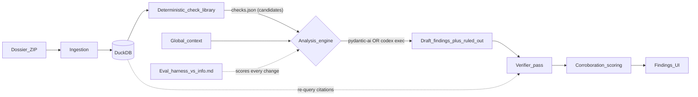

# Multi-Phase Plan: From 0 Findings to Reliable F1–F4 Detection

## Where we are

Both live runs on the sample dossier returned **0 findings** (`backend/data/batches/*/result.json`). Ingestion is solid (29 docs, ~33k rows, all target tables present in DuckDB: `kreditoren__lieferantenbuchungen`, `wareneingangsliste_2025`, `stammdatenaenderungen_2025`, `berechtigungsauswertung_2025__berechtigungen`, `av__anlagen`, `fakturajournal_januar_2026_kreditoren`, `sachkonten__sachkontobuchungen`, …). The failure is the analysis layer: one free-form agent in [backend/app/agent/auditor.py](backend/app/agent/auditor.py), ~4 LLM calls total, a prompt biased toward silence, and no feedback loop.

Target pipeline:

## Phase 0 — Eval harness (the feedback loop; do this first)

Without this we tune blind — this run's 0-findings miss wasn't even caught automatically.

- `backend/eval/answer_key.yaml`: machine-readable key derived from [data/info.md](data/info.md) — per scheme the identifying entities/rows (F1: vendor `209101`, user `MV-U05`; F2: six repair-named assets in classes 040000/060000; F3: the 8 Jan-2026 invoices with Dec `LEISTUNGSDATUM`; F4: vendor `200007`, 14.10.2025) and the 7 decoy entities (D1–D7). **Never enters any prompt.**
- `backend/scripts/eval.py`: runs the pipeline on `data/Uebungsdaten_Muster_Verpackungen.zip` (flag `--reuse-batch` to skip ingest/context and iterate on analysis only), matches findings to the key by cited table/entity/row overlap, and prints: recall per scheme (F1–F4), decoy false-positive count, finding count, wall-clock vs. the 10-min budget. Exit non-zero below a threshold so it doubles as CI.
- Store each eval run's scores under `backend/eval/runs/` so engine/prompt variants are comparable.

## Phase 1 — Deterministic check library (the detection win)

New package `backend/app/checks/` — named, generalizable checks as plain SQL/Python over the batch DuckDB, each returning a structured `CheckResult {check_id, title, description, hits: [{table, _row_ids, attributes}], notes}` with real `_row_id`s so results are citation-ready.

Checks (mirroring K1–K7 / user stories 6–9):
- `new_vendor_profile` — vendor created in-year, no prior-year balance, fast first invoice
- `missing_goods_receipt` — vendor invoices with no `wareneingangsliste_2025` match (three-way-match failure)
- `sod_creator_equals_approver` — `GEAENDERT_VON = GENEHMIGT_VON` in `stammdatenaenderungen_2025`
- `permission_concentration` — one user holding posting + payment-run + vendor-creation rights in the permission matrix
- `repair_vocab_in_assets` — repair vocabulary (Reparatur, Instandsetzung, Austausch, Generalüberholung, …) in asset names/postings vs. debit account (expense 670000-class vs. asset)
- `cutoff_unaccrued` — FAKTURADATUM in Jan vs. LEISTUNGSDATUM in Dec, joined to December goods receipts ("Rechnung offen") and absence of a matching year-end accrual in the ledger
- `threshold_split_cluster` — payments grouped by vendor+date near the approval limit (limit taken from global context, default €10,000)
- `round_amount_stats`, `off_hours_or_unusual_user` — lower priority, statistical color

Design constraints (this is what makes them survive the unseen final dossier):
- A **table/column resolver** that finds tables by fuzzy name + column signature (e.g. "the goods-receipt table" = table containing LIEFERANT/WE-date-like columns), not hardcoded names.
- Checks **emit candidates, not verdicts** — decoy discipline stays with the agent/verifier.
- Runnable standalone (`uv run python -m app.checks --batch <id>`) and executed automatically after ingestion, persisted as `checks.json` in the batch dir.

## Phase 2 — Rebalanced prompt + forced depth

Rework `INSTRUCTIONS` / `ANALYSIS_PROMPT` in [backend/app/agent/auditor.py](backend/app/agent/auditor.py):

- Feed the `checks.json` summary into the analysis prompt; agent's job becomes **corroborate → rule out innocents → narrate → cite**, not invent SQL hunts.
- Mandatory checklist: every check family that fired must be either reported as a finding or explicitly ruled out with cited evidence. State plainly: *"material corroborated issues must be reported; an empty findings list after checks fired is a failure mode."* Keep the decoy discipline language.
- Structured output gains a `ruled_out` list (`{title, reason, citations}`) — this is scored by judges ("checked, innocent because…") and blocks the silent-exit escape hatch.
- Force depth: multi-pass shape (profile → candidates → corroborate → output) with a minimum tool-call expectation; add `run_check`/`list_checks` agent tools so chat can re-run checks; raise pydantic-ai usage limits so the run can take many more rounds than the current ~4 calls.

Gate: eval harness must show F1–F3 recall (F4 bonus) with 0 decoy flags before moving on.

## Phase 3 — Codex as a headless analysis engine (pluggable, benchmarked)

Recommendation: don't rip out pydantic-ai — make the analysis step a **pluggable engine** and let the Phase 0 eval decide which one ships on judging day. Codex CLI (`codex exec`) is genuinely attractive here: it natively does long multi-round tool loops and can write/run its own Python+SQL against the DuckDB file (the PRD itself lists "Codex with code interpreters" as the fallback plan), which directly fixes the "very shallow run" failure.

- `backend/app/agent/engine.py`: `AnalysisEngine` protocol → `PydanticAIEngine` (current code) and `CodexEngine`; selected via `ANALYSIS_ENGINE` env var.
- `CodexEngine`: per batch, prepare a scratch workspace containing the `dossier.duckdb` copy, schema overview, `global_context.json`, `checks.json`, and a `PROMPT.md` (same JET methodology + checklist + required output schema). Run `codex exec --json -C <workspace> --sandbox workspace-write` headless, parse the final JSON findings, then validate through the **same** citation validator (re-query tables/`_row_id`s) before accepting.
- Chat + AG-UI streaming stays on pydantic-ai regardless — Codex is only the batch "hunter".
- Risks to manage: runtime inside the 10-min budget, JSON-output flakiness (retry/repair pass), requires codex auth on the demo machine. If eval shows it's not clearly better than PydanticAIEngine+checks, it stays a flag, not the default.

## Phase 4 — Verifier pass + corroboration scoring (protect the score)

- **Verifier**: second pass that independently re-derives each draft finding — re-executes the cited queries, confirms excerpts match rows, actively searches for the innocent explanation (four-eyes approval, real goods receipts, documented investment request/scrapping). Unverifiable claims are dropped; ruled-out items move to the `ruled_out` list.
- **Computed corroboration score**: replace the LLM's free likelihood guess with a count of *independent* supporting `document_id`s per finding (the briefing is explicit: F1-class = top marks only with 4 converging sources). Citation model already carries what's needed.
- Eval harness gets a "verified findings" mode so the precision gain is measured, not assumed.

## Phase 5 — Judging-day product (user stories 3, 4, 12)

Only after detection is reliable:

- **Accept / reject / annotate** per finding, persisted in the batch result (small FastAPI + React change, big "auditor in control" signal for Cortea).
- **Evidence viewer**: click a citation → `GET /api/batches/{id}/evidence?...` returns the table slice around `_row_id` or the prose passage, rendered highlighted (the DataSnipper bar).
- **Financial impact rollup**: reported profit (from the JA-Entwurf PDF already in `document_texts`) vs. corrected profit after accepted findings, as a header card.
- Surface in the UI: check-library results, the ruled-out/decoy list, and per-finding corroboration source count.

## Explicitly out of scope

Auth, multi-tenant, OCR, deployment — unchanged from [docs/roadmap.md](docs/roadmap.md).

## Sequencing note

Phase 0 is deliberately promoted above the report's ordering: it is a half-day script that converts every later phase from guesswork into a measured experiment, and it is the only way to fairly settle the pydantic-ai vs. Codex question in Phase 3.