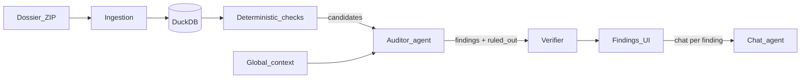

# AudiTrace

Hackathon MVP: upload a messy German GDPdU dossier ZIP, get cited fraud findings an auditor can review and chat about.

**AudiTrace** — every claim is backed by the exact row or passage.

Built for the [{Tech: Europe} × Almedia Hackathon | The Summer Lock-In](https://luma.com/berlin-summer-lock-in?tk=WfBvdX) — **won the Cortea track** and placed **2nd overall**. Detect planted schemes (fake vendors, capitalized repairs, cut-off errors, threshold splitting), avoid decoys, and keep every claim tied to exact rows/passages.

## How it works



1. **Ingest** — normalize CSV/TXT/XLSX/PDF/DOCX (German encodings, `1.234,56`, `DD.MM.YYYY`) into one per-batch DuckDB.
2. **Deterministic checks** — SQL/Python library emits *candidates* (new vendor, missing goods receipt, SoD, permissions, repair vocab, cut-off, threshold split), not verdicts.
3. **Global context** — cheap LLM pass over prose for policies (e.g. approval limits) and company facts.
4. **Auditor agent** — corroborates or rules out check hits with read-only SQL / check tools; deep multi-round loop (`AUDITOR_REQUEST_LIMIT`, default 40).
5. **Verifier** — second pass re-checks draft findings and scores multi-source corroboration.
6. **UI** — ranked findings with citations; AG-UI chat scoped to a finding.

The agent is primed with Journal Entry Testing methodology only — never with answer-key entities or scheme names.

## Stack

| Layer | Tech |
|---|---|
| Backend | Python 3.12, FastAPI, DuckDB, pydantic-ai |
| Frontend | Vite, React, TypeScript, Tailwind |
| Eval | `backend/scripts/eval.py` vs `backend/eval/answer_key.yaml` |

## Run locally

```bash
# backend — needs OPENAI_API_KEY in backend/.env (see backend/.env.example)
cd backend && uv sync && uv run uvicorn app.main:app --port 8000

# frontend — proxies /api → :8000
cd frontend && npm install && npm run dev   # http://localhost:5173

# mechanics check without an API key
cd backend && uv run python scripts/smoke_test.py
```

Useful env knobs: `AUDITOR_MODEL` (default `openai:gpt-5.6-sol`), `AUDITOR_REASONING_EFFORT`, `AUDITOR_REQUEST_LIMIT`.

## Repo map

- `backend/app/ingestion/` — ZIP → DuckDB
- `backend/app/checks/` — deterministic check library → `checks.json`
- `backend/app/agent/` — context, analysis, verifier, chat
- `backend/eval/` — answer key + scored runs
- `frontend/` — review + chat UI
- `docs/mvp.md` — what the MVP ships today
- `docs/roadmap.md` — backlog after MVP

## Where we are

Shipped: ingestion, check library, deeper analysis prompt + tools, eval harness, verifier pass.

Still open (judging-day polish): pluggable Codex analysis engine, accept/reject/annotate workflow, evidence viewer with highlighting, financial impact rollup.

See `.cursor/plans/reliable_fraud_detection_pipeline_87d0f944.plan.md` for the full multi-phase plan.
