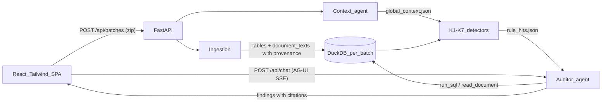

# MVP — Fraud Audit Agent

Context document for later work. Describes what exists after the MVP build, how it fits together, and what was deliberately left out. Source requirements: `pre-docs/prd.md`, `pre-docs/architecture.md`, `pre-docs/user-stories.md`.

## What it does

Upload a GDPdU dossier ZIP → everything is normalized into one DuckDB database → deterministic K1–K7 procedures generate evidence-backed investigation candidates → one Pydantic AI auditor verifies, dismisses, or combines those candidates → cited findings appear in a React single-page UI → each finding has a scoped "Chat with AI" panel (AG-UI protocol, streamed).



## Repo layout

- `backend/` — Python 3.12, managed with `uv` (`uv sync`, `uv run …`)
  - `app/models.py` — all shared contracts (see below)
  - `app/ingestion/` — ZIP → DuckDB (`pipeline.py`) + German-format normalization (`normalize.py`)
  - `app/detection/` — K1–K7 candidate procedures, ranking, cited evidence, and skipped-check reporting
  - `app/agent/auditor.py` — the single agent (analysis + chat + context extraction)
  - `app/storage.py` — batch directory layout
  - `app/main.py` — FastAPI routes
  - `scripts/smoke_test.py` — end-to-end test with a scripted model (no API key needed)
- `frontend/` — Vite + React + TS + Tailwind v4; `src/api.ts` contains a minimal hand-rolled AG-UI SSE client (no CopilotKit runtime server needed)

## Running it

```bash
# backend  (needs backend/.env with OPENAI_API_KEY, see backend/.env.example)
cd backend && uv sync && uv run uvicorn app.main:app --port 8000

# frontend (proxies /api to :8000)
cd frontend && npm install && npm run dev   # http://localhost:5173

# mechanics check without an API key
cd backend && uv run python scripts/smoke_test.py
```

Model is `openai:gpt-5.6-sol` by default, overridable via `AUDITOR_MODEL` (any pydantic-ai model string). Reasoning effort (`AUDITOR_REASONING_EFFORT`, default `medium`) and the analysis tool-round budget (`AUDITOR_REQUEST_LIMIT`, default 40) are also configurable — `gpt-5.1` was prone to stalling on a single long reasoning turn, so a faster reasoning model with a capped effort is the default.

## Batch lifecycle & storage

One directory per upload under `backend/data/batches/{batch_id}/` (gitignored):
`upload.zip`, `extracted/`, `dossier.duckdb`, `global_context.json`, `rule_hits.json`, `status.json`, `result.json`.

Pipeline stages (persisted in `status.json`, polled by the UI): `queued → extracting → ingesting → building_context → detecting → analyzing → done | error`.

## Data model & provenance rules

Ingestion (`app/ingestion/pipeline.py`) walks the extracted ZIP:

| Source | Result |
|---|---|
| GDPdU folders (`index.xml` + txt) | one table per declared table, named `{folder}__{table}` (e.g. `kreditoren__lieferanten`), columns from the XML schema |
| `*.csv` (semicolon, Latin-1/cp1252 or UTF-8) | one table per file, named after the file stem |
| `*.xlsx` | one table per sheet, named `{stem}__{sheet}` |
| `*.docx` / `*.pdf` | rows in `document_texts (document_id, file, ref, text)`, ref = `paragraph N` / `table T row R` / `page N` |

Provenance invariants — the basis of "no number without a source":

- Every source file gets a `document_id` (`doc-001`, … in sorted path order), registered in the `documents` table.
- Every tabular row carries `_row_id` = **physical line number in the source file** (GDPdU txt has no header → data starts at line 1; CSVs → line 2; XLSX → spreadsheet row number).
- Normalization is conservative: a column is converted to DATE/number only if *every* non-empty value parses (German `1.234,56` and `DD.MM.YYYY` formats); identifier-like values with leading zeros (account `020000`) always stay strings so joins and citations stay exact.

## Contracts (`backend/app/models.py`, mirrored in `frontend/src/types.ts`)

- `Citation {document_id, file, table?, rows?, sheet?, page?, passage?, excerpt?}`
- `RuleHit {id, rule_id K1-K7, subject, risk_score, signals, evidence, counter_evidence, missing_evidence}` — an investigation candidate, not a fraud conclusion
- `Finding {id ("F-001"…), title, description, likelihood 0-100, status, rule_ids, rule_hit_ids, amount_eur?, citations[]}`
- `GlobalContext {items: [{kind: company_fact|policy|terminology|document_relationship, statement, citations[]}]}`
- `BatchStatus {batch_id, stage, detail?, error?}` / `BatchResult {batch_id, status, documents, global_context?, findings}`

## API

- `POST /api/batches` (multipart zip) → `BatchStatus`; pipeline runs as a background task
- `GET /api/batches/{id}` → `BatchResult` (poll until `done`/`error`)
- `POST /api/chat` — **AG-UI protocol endpoint** (`AGUIAdapter.dispatch_request`): the client POSTs a `RunAgentInput` with `state = {batch_id, finding}` and receives an SSE stream (`TEXT_MESSAGE_CONTENT` deltas, `TOOL_CALL_*`, `RUN_FINISHED`). The finding scoping travels as AG-UI shared state, injected into agent deps via `StateDeps`.

## The agent (`app/agent/auditor.py`)

One general agent, three uses (same tools, same instructions builder):

- **Context agent** — one structured call over `document_texts` → `global_context.json` (facts, policies like approval thresholds, terminology; explicitly *no* fraud conclusions).
- **Analysis run** — `run_analysis(batch_id, rule_hits)`: the agent must disposition every candidate as `finding`, `dismissed`, or `needs_review`, then merge related candidates into cited findings. Runtime prompts never contain known entities or the sample answer key. The SQL tool accepts only internal `SELECT`/CTE queries. Citation validation checks table/document identity, physical rows, prose references, and excerpts. If model investigation fails or returns nothing, high-confidence deterministic candidates remain visible as `needs_review` findings.
- **Chat agent** — same tools, plain-text streamed output, finding context injected from AG-UI state.

## Verified

`scripts/smoke_test.py` (scripted `FunctionModel`, sample dossier): 29 documents ingest with zero warnings; all K1–K7 detectors execute; K1–K5 produce candidates; analysis produces a finding whose citation is re-queried and matched; AG-UI chat streams a full event sequence through `/api/chat`. A live LLM run needs `OPENAI_API_KEY`.

## Deliberate limitations (see docs/roadmap.md)

No second verifier agent, accept/reject workflow, evidence-viewer highlighting, financial-impact rollup, OCR, auth, or multi-user concurrency. K1–K7 are challenge-schema procedures and will need tuning against additional same-shaped dossiers. XLSX sheets with decorative header rows remain loosely typed. Chat history is client-side only.
