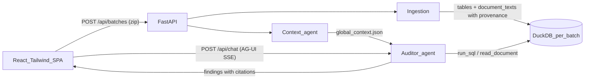

# MVP — Fraud Audit Agent

Context document for later work. Describes what exists after the MVP build, how it fits together, and what was deliberately left out. Source requirements: `pre-docs/prd.md`, `pre-docs/architecture.md`, `pre-docs/user-stories.md`.

## What it does

Upload a GDPdU dossier ZIP → everything is normalized into one DuckDB database → one Pydantic AI auditor agent explores it with a read-only SQL tool → findings with citations appear in a React single-page UI → each finding has a "Chat with AI" panel scoped to that finding (AG-UI protocol, streamed).



## Repo layout

- `backend/` — Python 3.12, managed with `uv` (`uv sync`, `uv run …`)
  - `app/models.py` — all shared contracts (see below)
  - `app/ingestion/` — ZIP → DuckDB (`pipeline.py`) + German-format normalization (`normalize.py`)
  - `app/agent/auditor.py` — the single agent (analysis + chat + context extraction)
  - `app/storage.py` — batch directory layout
  - `app/main.py` — FastAPI routes
  - `scripts/smoke_test.py` — end-to-end test with a scripted model (no API key needed)
- `frontend/` — Vite + React + TS + Tailwind v4; `src/api.ts` contains a minimal hand-rolled AG-UI SSE client (no CopilotKit runtime server needed)

## Running it

```bash
# backend  (needs backend/.env with OPENAI_API_KEY, see backend/.env.example)
cd backend && uv sync && uv run uvicorn app.main:app --port 8000

# frontend (proxies /api to :8000)
cd frontend && npm install && npm run dev   # http://localhost:5173

# mechanics check without an API key
cd backend && uv run python scripts/smoke_test.py
```

Model is `openai:gpt-5.1` by default, overridable via `AUDITOR_MODEL` (any pydantic-ai model string).

## Batch lifecycle & storage

One directory per upload under `backend/data/batches/{batch_id}/` (gitignored):
`upload.zip`, `extracted/`, `dossier.duckdb`, `global_context.json`, `status.json`, `result.json`.

Pipeline stages (persisted in `status.json`, polled by the UI): `queued → extracting → ingesting → building_context → analyzing → done | error`.

## Data model & provenance rules

Ingestion (`app/ingestion/pipeline.py`) walks the extracted ZIP:

| Source | Result |
|---|---|
| GDPdU folders (`index.xml` + txt) | one table per declared table, named `{folder}__{table}` (e.g. `kreditoren__lieferanten`), columns from the XML schema |
| `*.csv` (semicolon, Latin-1/cp1252 or UTF-8) | one table per file, named after the file stem |
| `*.xlsx` | one table per sheet, named `{stem}__{sheet}` |
| `*.docx` / `*.pdf` | rows in `document_texts (document_id, file, ref, text)`, ref = `paragraph N` / `table T row R` / `page N` |

Provenance invariants — the basis of "no number without a source":

- Every source file gets a `document_id` (`doc-001`, … in sorted path order), registered in the `documents` table.
- Every tabular row carries `_row_id` = **physical line number in the source file** (GDPdU txt has no header → data starts at line 1; CSVs → line 2; XLSX → spreadsheet row number).
- Normalization is conservative: a column is converted to DATE/number only if *every* non-empty value parses (German `1.234,56` and `DD.MM.YYYY` formats); identifier-like values with leading zeros (account `020000`) always stay strings so joins and citations stay exact.

## Contracts (`backend/app/models.py`, mirrored in `frontend/src/types.ts`)

- `Citation {document_id, file, table?, rows?, sheet?, page?, passage?, excerpt?}`
- `Finding {id ("F-001"…), title, description, likelihood 0-100, amount_eur?, citations[] (min 1 — enforced by the schema)}`
- `GlobalContext {items: [{kind: company_fact|policy|terminology|document_relationship, statement, citations[]}]}`
- `BatchStatus {batch_id, stage, detail?, error?}` / `BatchResult {batch_id, status, documents, global_context?, findings}`

## API

- `POST /api/batches` (multipart zip) → `BatchStatus`; pipeline runs as a background task
- `GET /api/batches/{id}` → `BatchResult` (poll until `done`/`error`)
- `POST /api/chat` — **AG-UI protocol endpoint** (`AGUIAdapter.dispatch_request`): the client POSTs a `RunAgentInput` with `state = {batch_id, finding}` and receives an SSE stream (`TEXT_MESSAGE_CONTENT` deltas, `TOOL_CALL_*`, `RUN_FINISHED`). The finding scoping travels as AG-UI shared state, injected into agent deps via `StateDeps`.

## The agent (`app/agent/auditor.py`)

One general agent, three uses (same tools, same instructions builder):

- **Context agent** — one structured call over `document_texts` → `global_context.json` (facts, policies like approval thresholds, terminology; explicitly *no* fraud conclusions).
- **Analysis run** — `run_analysis(batch_id)`: structured output `AnalysisReport`, primed with generic JET methodology only (never with known scheme names, entities, or the sample answer key), schema overview and global context in the instructions. Tools: `run_sql` (read-only DuckDB, 200-row cap, must select `_row_id` to cite) and `read_document`. An output validator rejects citations to non-existent tables (anti-hallucination net); the DuckDB connection is opened `read_only=True`.
- **Chat agent** — same tools, plain-text streamed output, finding context injected from AG-UI state.

## Verified

`scripts/smoke_test.py` (scripted `FunctionModel`, sample dossier): 29 documents ingested with zero warnings; analysis produced a `Finding` whose citation (`table` + `_row_id`) was re-queried and matched the excerpt; AG-UI chat streamed a full `RUN_STARTED → TEXT_MESSAGE_* → RUN_FINISHED` event sequence through `/api/chat`. A live LLM run needs `OPENAI_API_KEY`.

## Deliberate limitations (see docs/roadmap.md)

No deterministic test library, no verifier agent, no accept/reject workflow, no evidence-viewer highlighting, no financial-impact rollup, no multi-source corroboration scoring, no OCR, no auth, single-user concurrency only. XLSX sheets with decorative header rows land as loosely-typed tables (usable, not pretty). Chat history is client-side only.
